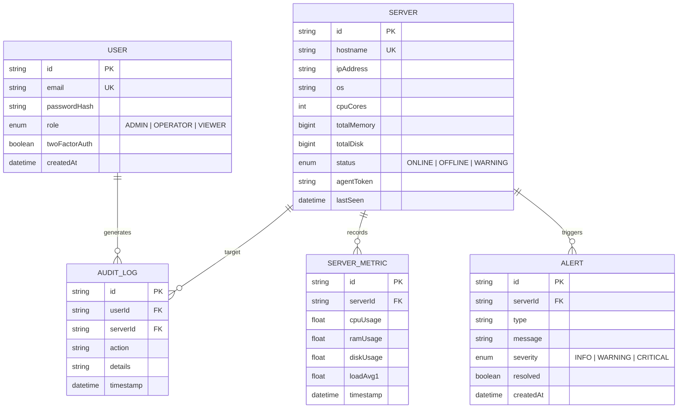

# PulseOps Platform Architecture

This document provides an enterprise technical overview of the **PulseOps (x19-pulse)** infrastructure monitoring, remote management, and real-time desktop control platform.

---

## 1. System Overview & Monorepo Structure

PulseOps is designed as a modular micro-services architecture composed of three primary layers:

```
                  ┌─────────────────────────────────────────────────────────┐
                  │                 PulseOps Web Dashboard                  │
                  │        (Next.js 15 App Router / Prisma ORM / Tailwind)   │
                  └─────────────┬─────────────────────────────┬─────────────┘
                                │                             │
                     HTTP / REST API                     Socket.IO WSS
                                │                             │
                                ▼                             ▼
                  ┌─────────────────────────────────────────────────────────┐
                  │              Realtime Gateway & Relay Server            │
                  │                 (Express.js / Socket.IO)                │
                  └─────────────▲─────────────────────────────▲─────────────┘
                                │                             │
                      Telemetry Pushes                  WebShell Exec
                        (JSON/HTTP)                           │
                                │                             │
            ┌───────────────────┴─────────────────────────────┴───────────────────┐
            │                                                                     │
  ┌─────────┴───────────┐                               ┌─────────────────────────┴─────────┐
  │ Python Agent Daemon │                               │   Go Static Binary Agent Daemon   │
  │  (/proc, systemd)   │                               │       (High Performance Agent)    │
  └─────────┬───────────┘                               └─────────────────────────┬─────────┘
            │                                                                     │
            └─────────────────────────┬───────────────────────────────────────────┘
                                      │
                            Target Linux Systems
                    (Syslog / x11vnc / websockify noVNC)
```

### Component Breakdown

| Directory | Component | Technology | Primary Function |
| :--- | :--- | :--- | :--- |
| `dashboard/` | **Web Dashboard** | Next.js 15 (React 19, TypeScript, TailwindCSS, Recharts) | Multi-node telemetry visualization, RBAC user management, interactive WebShell, real-time noVNC streaming display. |
| `server/` | **Realtime Gateway** | Node.js, Express, Socket.IO | High-throughput in-memory metric buffering, WebSocket client synchronization, and fallback HTTP command relay. |
| `agent/` | **Telemetry Daemon** | Python 3 / Go | Low-footprint, non-intrusive Linux system metrics collector (`/proc`, `ps`, `journalctl`) with systemd service wrappers and `noVNC` desktop streamer bridge. |

---

## 2. High-Level Data Flow Architecture

### Telemetry Pipeline
1. **Collector Loop**: The `pulseops-agent` daemon executes a non-blocking loop every 3 seconds, sampling kernel information directly from `/proc/stat`, `/proc/meminfo`, `/proc/loadavg`, and `statvfs('/')`.
2. **Metrics Ingestion**: Collected metrics (CPU, RAM, Disk, Load Average, Process list, Syslogs) are pushed via HTTP POST requests to `/api/agent/metrics` with Bearer token authentication.
3. **Gateway Ingestion & Broadcasting**: The Realtime Gateway buffers recent metrics history in memory and broadcasts `metrics_update` events via Socket.IO to connected web dashboard sessions.
4. **Database Persistence**: The dashboard can directly persist server metadata, alerts, and audit logs to PostgreSQL/Supabase using Prisma ORM.

### WebShell & Remote Terminal Execution
```
[User Interface] ---> (WebShell UI Tab) 
     │
     └──> POST /api/agent/metrics { action: "exec_terminal", hostname, command }
               │
               └──> Gateway Server / Bash Execution (`exec` in /bin/bash)
                         │
                         └──> Capture stdout / stderr / cwd changes
                                   │
                                   └──> Return formatted terminal output payload
```

### Remote Desktop Streaming (noVNC / x11vnc)
- The agent installer (`agent/install.sh`) provisions an `x11vnc` daemon attached to `DISPLAY=:0` along with `websockify`.
- `websockify` translates raw RFB (Remote Frame Buffer) VNC traffic from port `5900` to WebSocket traffic on port `6080`.
- The Web Dashboard embeds an inline noVNC viewer pointing directly to `http://<server-ip>:6080/vnc.html` for real-time remote GUI management.

---

## 3. Database Entity Relationship (Prisma / PostgreSQL)

PulseOps uses Prisma ORM configured for PostgreSQL / Supabase.



---

## 4. Scalability & Performance Considerations

1. **In-Memory History Ring-Buffers**:
   The Node.js Gateway maintains fixed-size ring buffers (`metricsHistory` capped at 50 items per host) in memory to guarantee low latency without overloading the primary PostgreSQL database for high-frequency telemetry.
2. **Stateless Static Go Agent**:
   For resource-constrained embedded or minimal Linux environments, the single static Go agent (`agent/main.go`) operates with zero runtime dependencies and negligible memory footprint (~5MB RSS).
3. **Decoupled Architecture**:
   The dashboard can be deployed independently on serverless platforms (e.g., Vercel), while the Gateway server runs on a lightweight VM or container handling persistent WebSockets.
